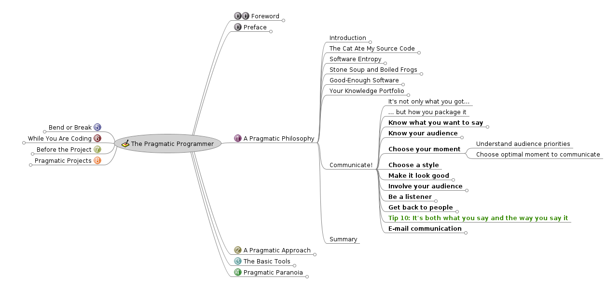
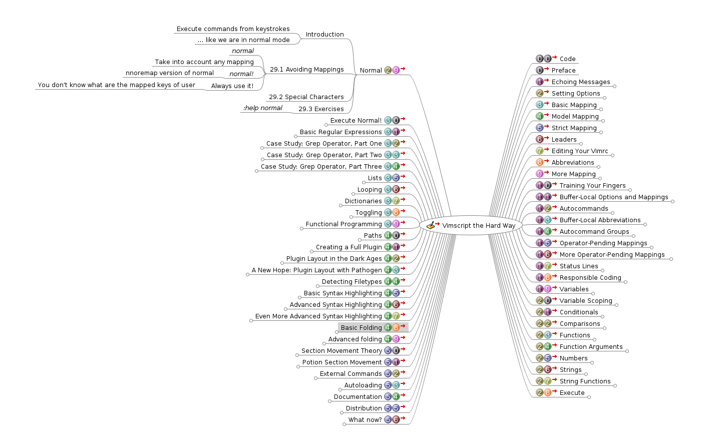
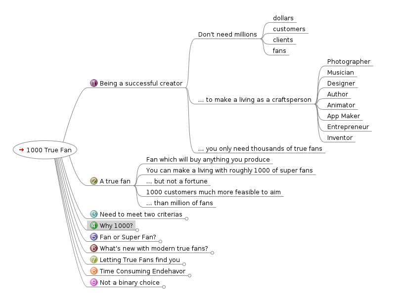

# Matthieu's Alexandria Library


## What's That?

Reading is not enough for me: to learn, I need to make the knowledge my own. The goal?

* To remember it.
* To use it in many different contexts ("transfer").

I love making *detailed mindmaps* of everything I find interesting. Here's how it looks like:

[](./pragmatic_programmer.png)

You'll find in this repository my free mindmap for The Pragmatic Programmer. You can clone everything and open `the_pragmatic_programmer.mm` with Freemind.

Using mindmaps allows me to:

* Easily review any piece of knowledge I want.
* Focus on some part of the knowledge I capture by hiding the branches.
* Test myself to see if I remember the knowledge by hiding the branches.
* Have a very visual version of the knowledge instead of trying to find the good place in a book or video.

I use the open source software [Freemind](https://sourceforge.net/projects/freemind/) to create these mindmaps. You'll need it if you want to look at them too.

Why freemind?

* It's simple.
* It's fast.
* It's stable.
* The interface is keyboard-friendly.
* The maps created are in plain text (XML). If you use Vim and the shell, you can search and filter everything you want.

I have mindmaps with hundred of nodes and Freemind never let me down.

## How to Access All the Mind maps?

The mindmaps are a gift if you support my work via [Github sponsors](https://github.com/sponsors/Phantas0s). I'll make all of them available for free for everyone if my goal of 2000/month is reached.

## Showcase

[](./vim_hard_way.png)
[](./1000_true_fans.png)

## Complete List

Here's the list of mindmaps (files with the extension ".mm") using `tree -P *.mm` in the shell:

```bash
.
├── business
│   ├── business_authority_ask_us_anything_2.mm
│   ├── business_authority_ask_us_anything_3.mm
│   ├── business_authority_ask_us_anything.mm
│   ├── business_profit_101_freelance_developer.mm
│   ├── carreer_management_2_0
│   │   └── career_management_2_0.mm
│   ├── choosing_consulting_project_give_energy.mm
│   ├── consulting
│   │   ├── anti_pattern_laboring_strategist.mm
│   │   ├── becoming_software_consultant.mm
│   │   ├── best_questions_ask_consulting_client.mm
│   │   ├── consultancy_for_developers.mm
│   │   ├── consulting_blueprint.mm
│   │   ├── consulting_skills_you_need_without_the_vague_platitudes.mm
│   │   ├── consulting_success.mm
│   │   ├── escaping_execution.mm
│   │   ├── how_to_become_a_management_consultant.mm
│   │   ├── how_to_start_consultancy_business
│   │   │   └── how_to_start_consultancy_business.mm
│   │   ├── making_the_leap_to_consulting.mm
│   │   ├── positioning_strategy_for_the_aspiring_consultant.mm
│   │   ├── positioning_yourself_to_coworkers_as_a_stealth_consultant.mm
│   │   ├── stop_posturing_to_your_peers.mm
│   │   ├── the_secret_of_consulting
│   │   │   └── the_secret_of_consulting.mm
│   │   ├── web_consultant_web_developer.mm
│   │   ├── when_to_systematize.mm
│   │   └── why_client_doesnt_take_decision_save_money.mm
│   ├── crossing_river_feeling_stones
│   │   └── crossing_river_feeling_stones.mm
│   ├── dealing_with_chaos.mm
│   ├── designing_ideal_bootstrapping_business.mm
│   ├── e-myth_revisited
│   │   └── e_myth_revisited.mm
│   ├── five_ways_to_specialize.mm
│   ├── freelancing
│   │   ├── better_freelance_business_in_2019.mm
│   │   ├── book_yourself_solid.mm
│   │   ├── ditching_hourly.mm
│   │   ├── firing_client.mm
│   │   ├── fixed_bids_vs_hourly_hours.mm
│   │   ├── freelance_wrong-questions.mm
│   │   ├── getting_started_with_freelancing.mm
│   │   ├── how_to_attract_clients_without_doing_sell.mm
│   │   ├── keeping_the_pipeline_full.mm
│   │   ├── making_money_from_open_source.mm
│   │   ├── positioning.mm
│   │   ├── setting_your_rates.mm
│   │   ├── starting_freelancing_as_an_employee.mm
│   │   └── the_freelancer_primer.mm
│   ├── getting_best_answers.mm
│   ├── getting_real.mm
│   ├── how_find_business_ideas_customer_want.mm
│   ├── how_to_brainstorm_great_project_ideas.mm
│   ├── how_to_find_100x_valuable_customer.mm
│   ├── how_to_measure_anything
│   │   ├── how_to_measure_anything.mm
│   │   └── resources
│   ├── how_to_speak_to_business_leader.mm
│   ├── if_your_innovation_effort_isnt_working_look_at_who_on_the_team.mm
│   ├── i_hate_mvp_so_do_your_customers
│   │   └── i_hate_mvp_so_do_your_customers.mm
│   ├── jason_cohen_interview.mm
│   ├── magic_the_gathering_twenty_years_twenty_lesson_learned.mm
│   ├── marketing
│   │   ├── 17_link_building_strategy.mm
│   │   ├── 5_ways_you_can_make_money_with_your_personnal_brand.mm
│   │   ├── content_marketing_strategies.mm
│   │   ├── developing_linkbait_for_a_non_technical_audience.mm
│   │   ├── human_email_automation.mm
│   │   ├── _INFOGRAPHICS
│   │   ├── keyword_difficulty.mm
│   │   ├── marketing_mindset.mm
│   │   ├── marketing_selling_own_product_service
│   │   │   └── marketing_selling_own_product_service.mm
│   │   ├── perfect_about_page.mm
│   │   ├── SEO
│   │   │   └── the_big_book_of_getting_people_to_link_to_you.mm
│   │   ├── seo_moz.com.mm
│   │   ├── strategic_seo_for_startups.mm
│   │   └── what_is_lead_generation
│   │       └── what_is_lead_generation.mm
│   ├── metrics
│   │   ├── tyranny_of_metrics.mm
│   │   └── work_less_get_more_done_analytics_for_maximizing_productivity.mm
│   ├── nacked_business_how_honesty_makes_you_more_money.mm
│   ├── networking
│   │   ├── informational_interview.mm
│   │   └── networking_for_people_who_hate_networking.mm
│   ├── niche
│   │   ├── choosing_an_unconventional_niche.mm
│   │   ├── choosing_a_speciality.mm
│   │   ├── dont_pick_nich_discover_them.mm
│   │   ├── how_to_pick_a_niche_start_listening_to_other_people.mm
│   │   ├── market_research_call_identify_validate_niche.mm
│   │   └── niching_down.mm
│   ├── personal_brand
│   │   └── developing_your_personal_brand
│   │       └── developing_your_personal_brand.mm
│   ├── positioning_for_soloists.mm
│   ├── psychology
│   │   └── playing_long_game_entrepreneurship_sustainable.mm
│   ├── revenue_streams
│   │   ├── 1000_true_fans.mm
│   │   ├── 9_perfect_products_for_dev.mm
│   │   ├── building_new_revenue_streams.mm
│   │   └── hack_your_career.mm
│   ├── rework.mm
│   ├── saas_startup
│   │   ├── a_software_business_five_hours_a_week.mm
│   │   ├── creating_a_business_that_can_thrive_without_you.mm
│   │   ├── epic_guide_bootstrapping_startup_by_yourself.mm
│   │   ├── from_productized_service_to_saas.mm
│   │   ├── how_to_evaluate_your_startup_idea
│   │   │   └── how_to_evaluate_startup_idea.mm
│   │   ├── pros_and_cons_building_saas.mm
│   │   └── quick_dirty_guide_startup_brand.mm
│   ├── sales
│   │   └── why_we_still_need_to_sell.mm
│   ├── setting_up_your_ecosystem.mm
│   ├── signs_your_message_is_not_working.mm
│   ├── _STUDIES
│   ├── survey
│   │   └── conducting_stakeholder_interview_survey.mm
│   ├── taking_risk.mm
│   ├── the_efficiencer.mm
│   ├── theory_of_constraints
│   │   └── theory_of_constraint_101.mm
│   ├── the_passion_economy.mm
│   ├── the_trusted_advisor_follow_up.mm
│   ├── the_trusted_advisor.mm
│   ├── the_why_conversation.mm
│   ├── training
│   │   ├── create_or_sell_an_online_course.mm
│   │   └── frelancer_show_-_303_genesis_of_a_course.mm
│   ├── uncovering_your_big_idea.mm
│   └── what_i_learned_cofounding_dribble.mm
├── computing
│   ├── analysis
│   │   ├── _PAPERS
│   │   │   ├── _ANNOTATED
│   │   │   └── technical_debt
│   │   │       ├── _ANNOTATED
│   │   │       └── _MINDMAPS
│   │   │           └── 2019_software_productivity_loss_due_technical_debt.mm
│   │   ├── software_design_x_ray
│   │   │   └── software_design_x_ray.mm
│   │   └── your_code_as_a_crime_scene
│   │       └── your_code_as_a_crime_scene.mm
│   ├── api
│   │   ├── graphql_grpc_or_rest
│   │   │   └── graphql_grpc_or_rest.mm
│   │   ├── how_to_design_good_api.mm
│   │   ├── REST
│   │   │   ├── _ANNOTATED
│   │   │   └── rest.mm
│   │   └── rest_vs_rpc.mm
│   ├── architecture
│   │   ├── building_evolutionary_architecture
│   │   │   └── building_evolutionary_architecture.mm
│   │   ├── ddd_quickly
│   │   │   └── ddd.mm
│   │   ├── design_composition_performance.mm
│   │   ├── implementing_domain_driven_design
│   │   │   └── implementing_domain_driven_design.mm
│   │   ├── _PAPERS
│   │   │   └── _ANNOTATED
│   │   ├── strategic_design_evans.mm
│   │   └── the_most_important_design_guideline.mm
│   ├── computer_science
│   │   ├── 00_introduction
│   │   │   └── uc_berkeley_cs10_2010
│   │   │       ├── 08_concurency
│   │   │       │   └── concurency.mm
│   │   │       └── 13_applications_that_changed_the_world.mm
│   │   ├── 01_programming
│   │   │   └── sicp
│   │   │       ├── berkeley_cs61a
│   │   │       │   ├── above_line_view.mm
│   │   │       │   ├── below_line_view.mm
│   │   │       │   └── scheme_class_61A.mm
│   │   │       └── book
│   │   │           ├── order_of_growth
│   │   │           └── sicp.mm
│   │   ├── 03_algorithm_data_structure
│   │   │   └── algorithm_data_structure.mm
│   │   ├── 04_mathematics
│   │   │   ├── concrete_mathematics
│   │   │   │   └── concrete_mathematics.mm
│   │   │   ├── discrete_mathematics_and_its_application
│   │   │   │   ├── discrete_mathematics_and_its_applications.mm
│   │   │   │   └── solutions
│   │   │   ├── discrete_math_you_need_to_know.mm
│   │   │   └── mit_mathematics_for_computer_science
│   │   │       └── mit_mathematics_for_computer_science.mm
│   │   ├── 06_computer_networking
│   │   │   └── computer_networking_top_down_approach
│   │   │       ├── computer_networking.mm
│   │   │       └── Wireshark Labs
│   │   │           └── Kurose_Ross_Wireshark_labs_7th_ed
│   │   ├── oral_history_john_mc_carthy.mm
│   │   └── power_abstraction_liskov.mm
│   ├── database
│   │   ├── how_does_a_relational_database_works.mm
│   │   └── _INFOGRAPHICS
│   ├── data_science
│   │   └── data_warehouse.mm
│   ├── devops
│   │   ├── 9_metrics_that_can_make_a_difference.mm
│   │   ├── accelerate
│   │   │   └── accelerate.mm
│   │   ├── kubernetes_basics
│   │   │   └── official_kubernetes_tutorial.mm
│   │   ├── kubernetes_docker_guru
│   │   │   └── kubernetes_docker_guru.mm
│   │   ├── stress_free_game_development_with_devops
│   │   │   └── stress_free_game_development_with_devops.mm
│   │   └── _STUDIES
│   ├── distributed_systems
│   ├── game
│   │   └── webgl_fundamentals
│   │       └── webgl_fundamentals.mm
│   ├── git
│   │   └── pro_git
│   │       └── pro_git.mm
│   ├── hardware
│   ├── _INFOGRAPHICS
│   │   └── vim
│   │       └── cheatsheets
│   ├── languages
│   │   ├── bash
│   │   │   └── _CHEATSHEETS
│   │   ├── clojure
│   │   │   ├── agility_robustness_spec
│   │   │   │   └── agility_and_robustness_clojure_spec.mm
│   │   │   ├── clojure_for_the_brave_and_true
│   │   │   │   └── clojure_for_the_brave_and_true.mm
│   │   │   └── modern_cljs.mm
│   │   ├── golang
│   │   │   ├── advanced_testing_with_go_by_mitchell_hashimoto.mm
│   │   │   ├── concurency_in_go.mm
│   │   │   ├── concurency_is_not_parallelism.mm
│   │   │   ├── delve_talk_-_go_internal.mm
│   │   │   ├── design_command_line_tool_people_love
│   │   │   │   └── design_command_line_tool_people_love.mm
│   │   │   ├── design_philosophie
│   │   │   │   └── design_philosophie.mm
│   │   │   ├── go_beautiful_package.mm
│   │   │   ├── go_in_action.mm
│   │   │   ├── go_scheduler
│   │   │   │   └── go_scheduler.mm
│   │   │   ├── introduction_to_interfaces
│   │   │   │   └── introduction_to_interfaces.mm
│   │   │   ├── language_mechanics
│   │   │   │   └── language_mechanics.mm
│   │   │   └── static_analysis_in_go.mm
│   │   ├── lisp
│   │   │   └── recursive_mc_carthy.mm
│   │   └── php
│   │       ├── marco_pivetta_doctrine_orm_good_practices_and_tricks.mm
│   │       └── symfony_con_2016
│   ├── misc
│   │   ├── being_good_is_overrated.mm
│   │   ├── building_highly_reliable_websites_for_small_companies.mm
│   │   ├── dan_ingalls_oop.mm
│   │   ├── dont_call_yourself_a_programmer_and_other_career_advice.mm
│   │   ├── engineering_you.mm
│   │   ├── fp_high_school_algebra
│   │   ├── how_to_think_like_a_programmer.mm
│   │   ├── implementing_a_strong_code_review_culture.mm
│   │   ├── lean_code
│   │   │   └── lean_code.mm
│   │   ├── learn_to_impact_the_business_as_a_developer.mm
│   │   ├── math_for_programmers
│   │   │   └── math_for_programmer.mm
│   │   ├── old_is_the_new_new.mm
│   │   ├── on_abstraction.mm
│   │   ├── programming_across_paradigms
│   │   │   └── programming_across_paradigms.mm
│   │   ├── requirement_example
│   │   ├── secret_growing_your_engineering_carreer_if_you_don_t_want_to_manage.mm
│   │   ├── simple_made_easy
│   │   │   └── simple_made_easy.mm
│   │   ├── taking_back_software_engineering
│   │   │   └── taking_back_software_engineering.mm
│   │   ├── the_pragmatic_programmer
│   │   │   └── the_pragmatic_programmer.mm
│   │   ├── things_that_matters.mm
│   │   └── unicode_character_set
│   │       └── unicode_character_set.mm
│   ├── network
│   ├── _PAPERS
│   │   ├── _ANNOTATED
│   │   ├── code_review
│   │   ├── concurrency
│   │   ├── inheritance
│   │   │   └── _ANNOTED
│   │   ├── mouseless
│   │   │   ├── _ANNOTATED
│   │   │   └── thebluedragons
│   │   ├── paradigms
│   │   │   └── _ANNOTATED
│   │   └── type
│   │       └── abstract_data_type
│   │           └── _ANNOTATED
│   ├── shell
│   │   ├── better_bashing_through_technology.mm
│   │   ├── cli_design_best_practice.mm
│   │   ├── refactoring_in_bash_functions.mm
│   │   ├── the_awk_programming_language.mm
│   │   └── zsh.mm
│   ├── _SLIDES
│   ├── soft_skills
│   │   └── _PAPERS
│   │       └── _ANNOTATED
│   ├── technical_interviewing_you_doing_it_wrong.mm
│   └── vim
│       ├── cutomizing_vim
│       │   └── customizing_vim.mm
│       ├── practical_vim.mm
│       ├── user_manual.mm
│       └── vimscript
│           └── vimscript_the_hard_way
│               └── I_vimscript_the_hard_way.mm
├── design
│   ├── color_theory.mm
│   ├── _INFOGRAPHICS
│   ├── photoshop_blend_modes.mm
│   └── pixel_art_tutorial_complete_guide.mm
├── economics
│   └── freakonomics.mm
├── _githooks
├── health
│   └── _INFOGRAPHICS
├── _IN_PROGRESS
│   ├── introduction_to_computer_networking
│   │   └── introduction_to_computer_networking.mm
│   └── magic_trick_of_testing.mm
├── languages
│   ├── Deutsch
│   │   ├── dfe.mm
│   │   ├── german.mm
│   │   ├── infographics
│   │   └── netzwerk_solutions
│   └── English
│       ├── infographics
│       └── ommiting_that.mm
├── management
│   ├── okr_agile_stop_waterfall_goals
│   │   └── okr_and_agile_stop_waterfall_goals.mm
│   ├── patterns_of_effective_teams.mm
│   └── _STUDIES
├── mathematics
│   ├── general_mathematics.mm
│   └── introduction_to_mathematical_thinking
│       └── introduction_to_mathematical_thinking.mm
├── philosophy
│   ├── fallacies.mm
│   └── _INFOGRAPHICS
├── photography
│   ├── camera_sensors.mm
│   ├── infographics
│   └── photography_business_elia_locardi.mm
├── productivity
│   ├── action_mindmap_system
│   ├── infographics
│   ├── productivity_not_time_management_but_attention_management.mm
│   └── work_less_get_more_done_analytics_for_maximizing_productivity.mm
├── public_speaking
│   └── _INFOGRAPHICS
├── self_improvement_psychology
│   ├── 3_tactics_against_procrastination.mm
│   ├── beyond_burnout_how_to_work_hard_and_enjoy_life.mm
│   ├── emotional_intelligence
│   │   └── emotional_intelligence.mm
│   ├── how_to_be_successful.mm
│   ├── how_to_win_friend_and_influence_people.mm
│   ├── infographics
│   ├── just_listen_how_to_reach_anyone.mm
│   ├── laziness_does_not_exist.mm
│   ├── mental_models
│   │   └── mental_models.mm
│   ├── _PAPERS
│   │   ├── burnout
│   │   ├── cognitive_load_theory
│   │   ├── communication
│   │   │   └── _ANNOTATED
│   │   ├── feedback
│   │   ├── imposter_syndrome
│   │   │   └── _ANNOTATED
│   │   ├── informal_logic
│   │   │   └── _ANNOTATED
│   │   ├── soft_skills
│   │   │   └── _ANNOTATED
│   │   └── stress
│   │       └── _ANNOTATED
│   ├── psychology_of_focus.mm
│   ├── the_willpower_instinct.mm
│   ├── we_are_all_confident_idiots.mm
│   └── zen_body_being.mm
├── system
│   └── introduction_to_system_thinking
│       └── introduction_to_system_thinking.mm
├── teaching_learning
│   ├── 10_lessons_mit_education.mm
│   ├── a_mind_for_numbers.mm
│   ├── how_to_speak.mm
│   ├── memory_unlimited.mm
│   ├── _PAPERS
│   │   └── _ANNOTATED
│   ├── the_science_of_accelerated_learning.mm
│   └── ultralearning.mm
└── writing
    ├── 11_reasons_people_bounce_from_your_blog_and_never_return.mm
    ├── blogging
    │   ├── blogging_guide.mm
    │   ├── blog_topic_planning.mm
    │   ├── great_blog_post.mm
    │   ├── how_to_produce_killer_content.mm
    │   ├── refreshing_your_blog_posts.mm
    │   └── this_is_our_fist_post_and_other_title_you_should_not_publish.mm
    ├── keys_to_great_writing
    │   └── keys_to_great_writing.mm
    ├── on_writing_well.mm
    ├── _SLIDES
    ├── write_to_express_not_to_impress.mm
    └── writing_is_thinking_learning_to_write_with_confidence.mm

190 directories, 238 files
```
